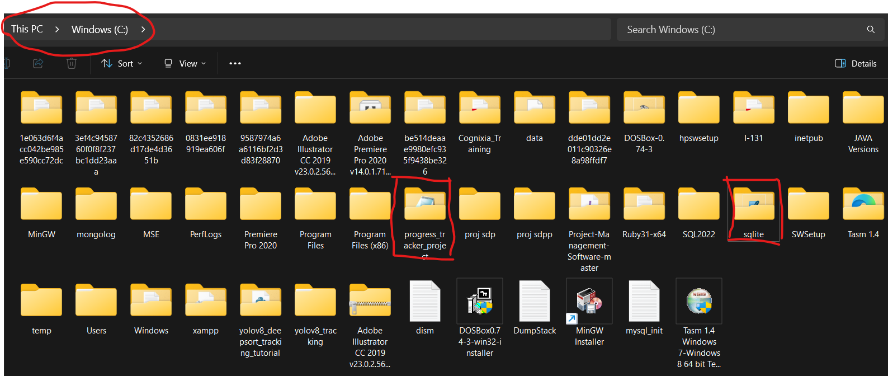
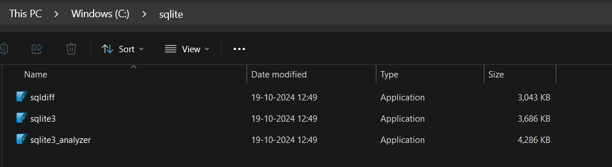

# Progress Tracker

## Project Aim
The Progress Tracker is a Python-based application designed to help users track their progress on Books. The application provides functionality for users to pick their book, manage their readlists and book progress, while admins can manage user accounts and book entries.
Intend to Improve on the frontend, currently created a rough layout

## Features
- User and Admin authentication
- Progress tracking for books
- Book rating and readlist management
- Separate User and Admin panels with distinct functionalities
- Database management using SQLAlchemy and Alembic (not Django ORM)
  
## Technologies Used
- Python
- Django (web framework)
- SQLAlchemy (ORM)
- Alembic (database migration)
- SQLite (database)

## Setup Requirements
Refer to `'progress_tracker_project/requirements.txt'` 

### Prerequisites
- Python 3.x installed
- pip (Python package manager)
- Virtual environment (recommended)
  
### Installation Steps
1. **Extract the Project**: Extract the project folder in the `C:` drive as there are paths that reference this location.

2. **Clone the repository**:

   git clone <repository-url>
   cd progress_tracker_project

3. **Create a virtual environment**:

python -m venv venv
Activate the virtual environment:

On Windows:
venv\Scripts\activate

On macOS/Linux:
source venv/bin/activate

Install dependencies:
pip install -r requirements.txt

4. **Database Setup**:

***Remember to set up SQLITE by keeping installation folder in C: drive***
Download SQLite :'https://www.sqlite.org/2024/sqlite-dll-win-x86-3470000.zip'

Folder should look something like this : 



### Alembic for Database Migrations
Alembic is used for managing database migrations since SQLAlchemy is the ORM, not Django ORM.

- **SQLite Database File Location**:
  The SQLite database file is located in `'root'/progress_tracker/progress_tracker/progress_tracker.db'`.

- **Data Files**:
  In `'progress_tracker/db'`:
  - Original books dataset CSV file.
  - numpy/pandas script for database cleaning.
  - Cleaned dataset CSV file.
  - Script to insert cleaned books data into the SQLite database.

- **SQLAlchemy Connection**:
  Connecting the SQLite database to SQLAlchemy is handled in `'progress_tracker/tracker_app/models.py'`.

5. **Run the Application**:

From the project root (Pprogress_tracker_project), start the Django server: `python manage.py runserver`
Access the application: Open a web browser and go to `http://127.0.0.1:8000` (or URL shown in terminal).

> **Note**: Not rendering all books in the admin panel's manage books as it requires high overhead. To fetch all books, remove `limit()` in views in the `admin_book_management` function.

### Important Notes

- **Scripts Folder**: The `scripts/` folder can be ignored; it contains scripts used to check the project structure.
- **Database Path**: In `models.py`, there is a direct `C:` path reference to connect to the SQLite database for inserting book data.

---

### User Credentials for Reference (passwords are hashed in the database):

| Username      | Password    |
|---------------|-------------|
| John Doe      | pass        |
| Jane Smith    | securepass  |
| Alice Brown   | alice123    |
| Bob White     | bobstrong   |
| Prachi        | pw          |
| Francis       | mypass      |
| Mary          | 12345       |

---

### Admin Credential

Only one admin account is set up, as there’s no functionality for creating additional admins.

| Username | Password         |
|----------|-------------------|
| admin1   | adminpassword1    |

> Feel free to create or remove users through 'Register' or 'Add user' or 'Remove user'. Just remember the password.

---

- **Custom Exceptions**: In `'progress_tracker/tracker_app/terminal_scripts/exceptions.py'`.
- **Password Management**: In `'progress_tracker/tracker_app/auth.py'`.
- **Files/Folders to Ignore**: `'progress_tracker/progress_tracker.db'`, `'progress_tracker/scripts'`.

> **Do not change configurations** in `settings.py`, `manage.py`, `wsgi.py`, or `asgi.py`.

---

## Project Versions
This project has two versions:

### Terminal Version:

Terminal scripts/code can be found in 'progress_tracker/tracker_app/terminal_scripts'

Run from root directory using:

```bash
python -m progress_tracker.tracker_app.terminal_scripts.main_menu ***
```

- This version provides options for all the project features mentioned above as well.
- Navigate with input option numbers when prompted 
- For overview of structure refer below : 

    run the main_menu.py in terminal -> form root dir
    -> 'python -m progress_tracker.tracker_app.terminal_scripts.main_menu'
    -> Home Page : Admin/User Login, Register User 
    Depending on credentials, we see user/admin Main Menu page
    -> User Main Menu : Menu Page, Progress Tracker Page, User Profile, Log out
    -----> Menu Page: View Books, Search Books and Add to Readlist, Return to Main menu 
    -----> Progress Tracker Page (displays main book progress) : Update Book Status, Rate Completed Book
    -----> User Profile Page : Change Username, Change Password, Remove Books from Readlist
    -> Admin Main Menu: User Settings, Book Management, Log Out
    ----> User Settings : Add User, Remove User, Go Back to Main Menu
    ----> Book Management : Edit Book Details, Remove Book, Go Back to Main Menu


### Frontend Version:

Django-based frontend application files are located in the `'tracker_app/templates/' ` and `'tracker_app/views.py'` for the views `'tracker_app/urls.py' `

Run the frontend using:
```bash
python manage.py runserver
```
Access via http://127.0.0.1:8000 to explore the Admin and User interfaces, where the user can log in, view books, manage their readlist, and update book statuses.

**Project Output Screenshots**
- 
- 
- 
- 
- 
- 
- 
- 
- 
- 
